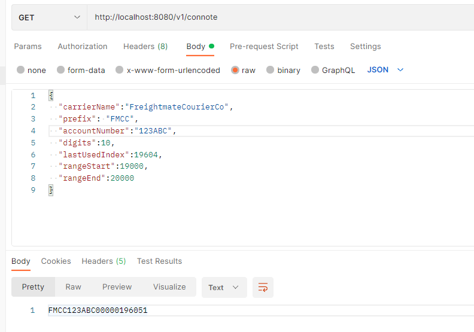
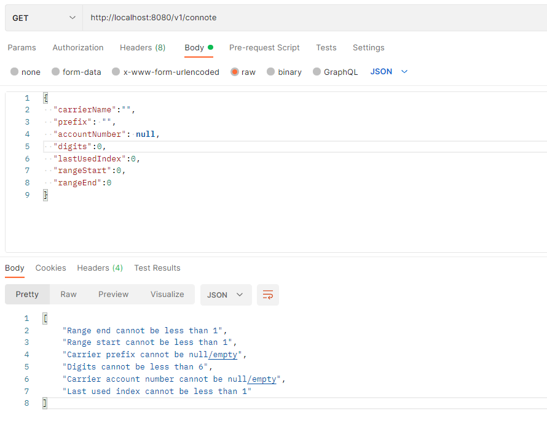
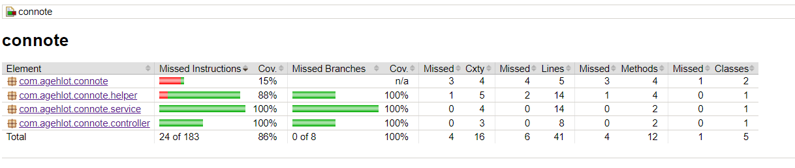

# connote
Consignment Note Number Generator Project

It's a SpringBoot application with one GET API Endpoint.
```
[GET] /v1/connote
```
It expects a carrier account object with carrier details and return the new consigment note number


# How to run the application
* Clone the repository
    ```
    https://github.com/apoorv-gehlot/connote.git
    ```
* Run the command
    ```
    .\mvnw spring-boot:run
    ```
    It will run the application on port ```8080```

* Access the application
    ```http://localhost:8080/v1/connote```
    
    Provide the following carrier object in the body of the request
    ```json
    {
        "carrierName":"FreightmateCourierCo",
        "prefix": "FMCC",
        "accountNumber":"123ABC",
        "digits":10,
        "lastUsedIndex":19604,
        "rangeStart":19000,
        "rangeEnd":20000
    }
    ```

    

## Validation
Basic validation are added on the required fields



## Test Cases
* Basic test cases for next generated code
* Basic test cases for validation
* Test coverage report is also included

